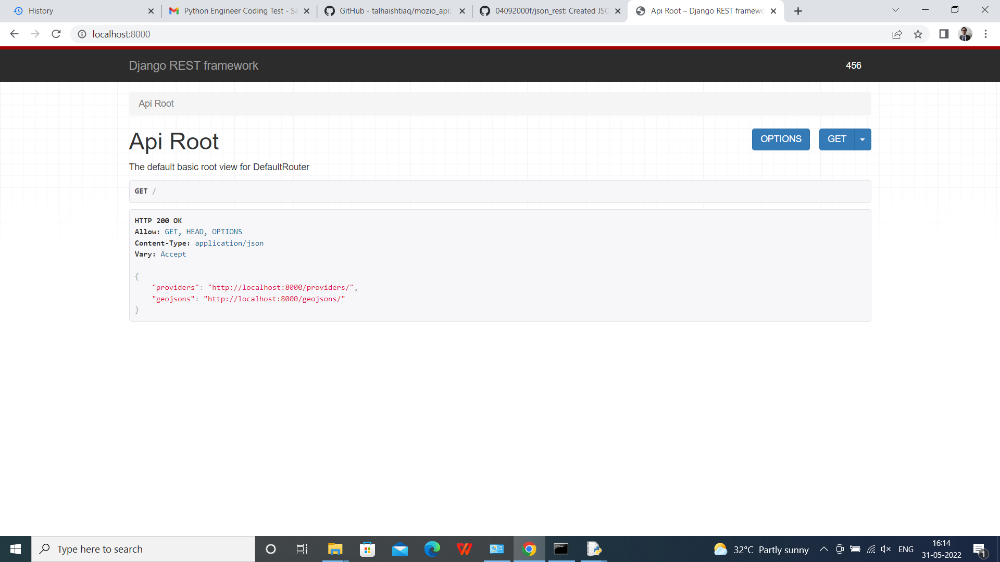
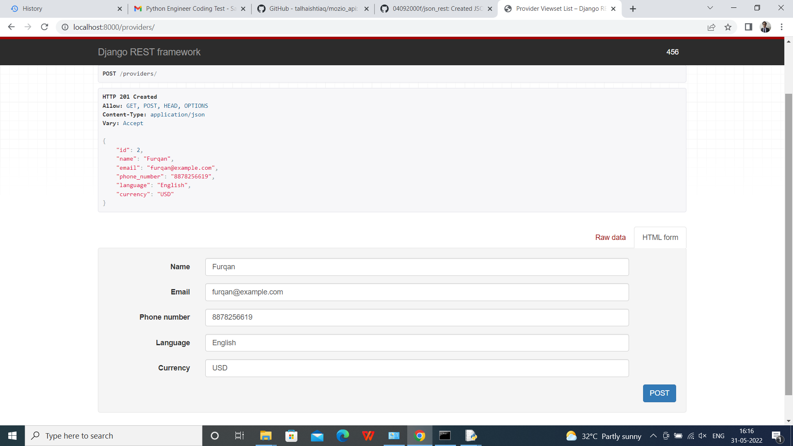
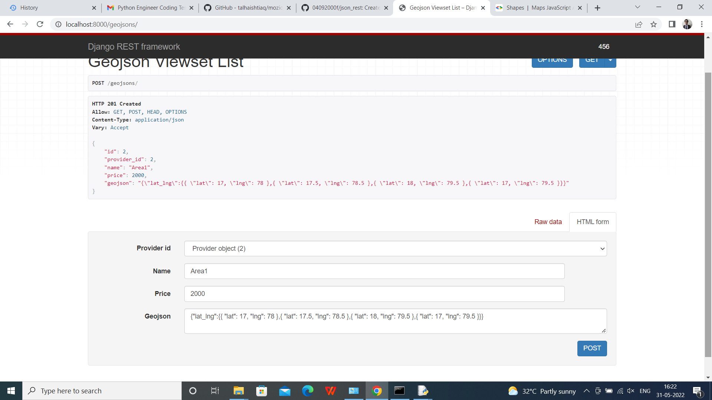
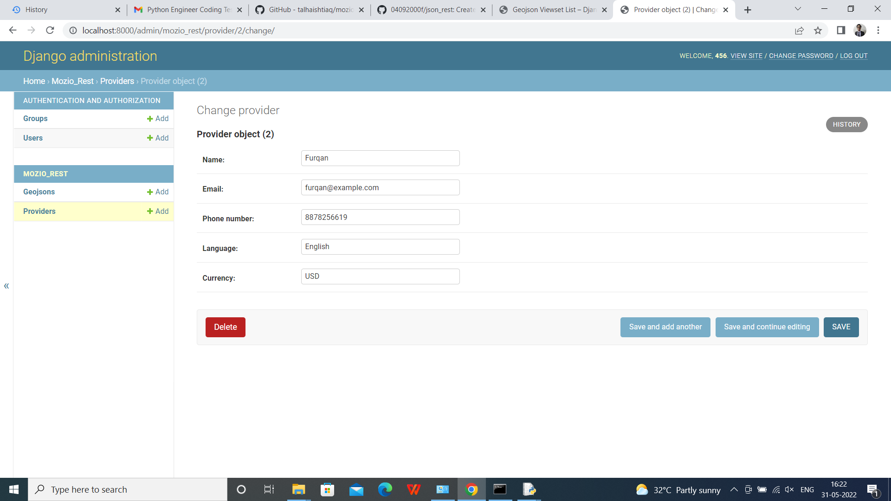
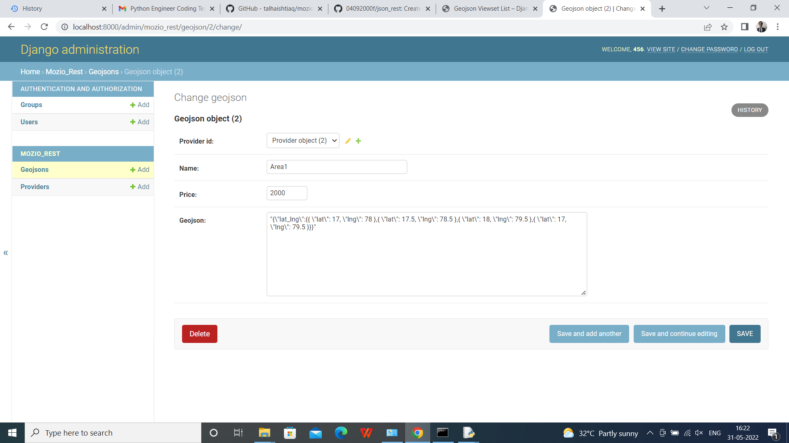

# json_rest
Created JSON REST API with CRUD operations for Provider (name, email, phone number, language and currency) and ServiceArea (name, price, geojson information)

## How our Root Api Actually Looks

## Initialising Our Providers in API Root

## Providers initialising Polygons in API Root

## Checking if the Provider and Geojson Object are Created and Stored in Database

